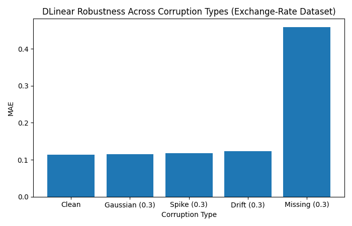
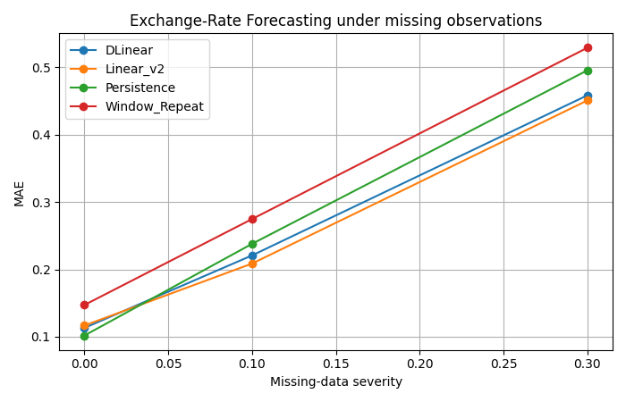
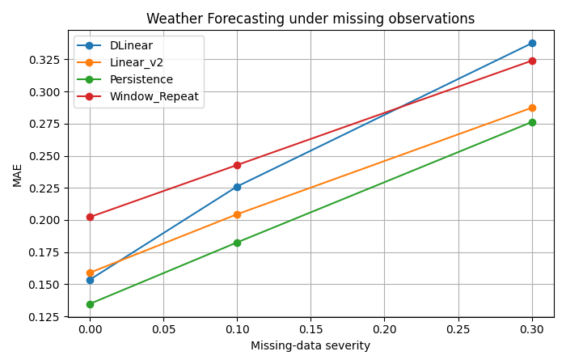

# 📊 Real-Time Time-Series Forecasting: Operational Robustness Benchmark

## Project Overview & Motivation

Time-series forecasting models are typically evaluated on clean, offline benchmark datasets. While useful for measuring predictive accuracy, these evaluations often fail to capture the conditions encountered in real-world deployment environments.

In production systems such as financial data pipelines, sensor networks, smart infrastructure, and industrial monitoring platforms, data is rarely perfect. Missing observations, noisy measurements, transient outages, anomalous spikes, and distribution drift can significantly impact forecasting performance.

This project investigates a simple question:

**How robust are forecasting models when the assumptions of clean offline evaluation no longer hold?**

To answer this, I built an end-to-end forecasting benchmark framework that combines:

* Offline model training
* Streaming inference simulation
* Operational fault injection
* Robustness evaluation
* Automated result aggregation and reporting

The framework evaluates forecasting models under a controlled set of realistic operational failures using an Operational Fault Injection Matrix that introduces:

* Missing observations
* Gaussian noise
* Spike anomalies
* Distribution drift

Rather than focusing solely on forecasting accuracy, the benchmark measures how model performance degrades as operational conditions deteriorate, providing insight into the reliability of forecasting systems in production environments.

## Core Objective

The primary objective of this project is to bridge the gap between offline forecasting evaluation and real-world operational deployment.

While forecasting models are typically trained and evaluated on clean historical datasets, production systems must operate under imperfect conditions where observations may be missing, corrupted, delayed, or subject to distribution shifts. As a result, predictive accuracy measured on offline benchmarks may not reflect real-world performance.

To investigate this gap, I developed an end-to-end robustness benchmarking framework that combines:

* Offline model training
* Streaming inference simulation
* Operational fault injection
* Automated robustness evaluation

Using a controlled Operational Fault Injection Matrix, the framework evaluates forecasting models under varying levels of missing data, Gaussian noise, spike anomalies, and distribution drift.

Rather than focusing solely on forecasting accuracy, the goal is to measure how model performance degrades as operational conditions deteriorate, identify dominant failure modes, and compare the robustness characteristics of neural forecasting architectures against simple yet competitive baseline methods.

## Defining Success

This project was not designed to maximize forecasting accuracy on a particular benchmark. Instead, the objective was to build a complete, reproducible, and extensible framework for evaluating forecasting robustness under realistic deployment conditions.

Success was defined across five dimensions:

### 1. Reproducibility

A user should be able to clone the repository, execute a small number of commands, and reproduce all benchmark results.

Success Criteria:

* Deterministic experiment configuration
* Automated evaluation pipeline
* Reproducible result generation
* Centralized configuration of datasets, models, and corruption scenarios

### 2. End-to-End Functionality

The framework should support the complete forecasting workflow rather than a standalone model implementation.

Success Criteria:

* Dataset ingestion
* Model training
* Operational fault injection
* Streaming inference simulation
* Evaluation and reporting

### 3. Robustness Evaluation

The system should quantify model behavior under realistic operational failures.

Success Criteria:

* Missing-observation simulation
* Gaussian noise injection
* Spike anomaly injection
* Distribution drift simulation
* Multiple severity levels for each fault type

### 4. Comparative Analysis

The framework should enable meaningful comparisons between forecasting approaches.

Success Criteria:

* Learned models and classical baselines evaluated under identical conditions
* Consistent metrics across datasets and corruption scenarios
* Automated result aggregation
* Quantitative degradation analysis through tables and visualizations

### 5. Insight Generation

The project should produce actionable conclusions beyond raw forecasting metrics.

Success Criteria:

* Identification of dominant failure modes
* Measurement of robustness degradation
* Analysis of model ranking changes under corruption
* Evaluation of robustness versus clean-data performance
* Practical observations relevant to production forecasting systems

### Outcome

The project is considered successful if it produces reproducible evidence about how forecasting models behave under realistic deployment conditions while remaining easy to run, extend, and analyze.

Rather than asking *"Which model is most accurate?"*, this benchmark is designed to answer *"Which models remain reliable when real-world assumptions begin to fail?"*


# 🏗️ System Architecture & Supported Configurations

The benchmark consists of two primary components:

1. A forecasting model evaluation layer
2. An Operational Fault Injection Matrix used to simulate realistic deployment failures

## Model Matrix

The framework evaluates both learned forecasting architectures and simple baseline methods to understand how model performance changes under operational stress.

* **DLinear (`dlinear`):** A decomposition-based forecasting architecture that separates input sequences into trend and seasonal components before applying independent linear projections. DLinear serves as the primary neural forecasting model evaluated in this benchmark.
* **Linear (`linear_v2`):** A direct linear forecasting model that maps historical observations to future horizons without explicit trend-seasonal decomposition. This model provides a lightweight neural baseline for comparison.
* **Naive Persistence (`naive_persistence`):** A classical forecasting baseline that assumes the most recently observed value will persist into the future:
  $$X_{t+h} = X_t$$
  Despite its simplicity, persistence is often highly competitive on slowly changing time-series and serves as an important reference point.
* **Window Repeat (`window_repeat`):** A historical-pattern baseline that repeats the most recent context window directly into the forecast horizon. This approach evaluates whether recurring local patterns alone can provide useful forecasts.

## Operational Fault Injection Matrix

Forecasting systems deployed in production rarely operate on perfect data. To evaluate robustness under realistic deployment conditions, the benchmark injects controlled operational faults into the input stream before inference. Each fault is evaluated across multiple severity levels, allowing robustness degradation to be quantified and compared across forecasting models.

* **Clean Baseline (`none`):** No corruption is applied to the input sequence. This scenario establishes the reference performance for each forecasting model.
* **Gaussian Noise (`gaussian`):** Random high-frequency noise is added to the input sequence to simulate sensor jitter, measurement uncertainty, and noisy observations.
* **Spike Anomalies (`spike`):** Transient high-magnitude perturbations are injected into the input stream to simulate outliers, abnormal events, or sudden operational disruptions.
* **Distribution Drift (`drift`):** Gradual shifts are introduced into the data distribution to emulate changing environmental conditions, sensor recalibration effects, or evolving market behavior.
* **Missing Observations (`missing`):** Contiguous blocks of observations are removed from the input sequence to simulate network outages, telemetry loss, delayed data arrival, or incomplete sensor reporting.

Together, the forecasting models and Operational Fault Injection Matrix enable systematic evaluation of forecasting robustness under realistic deployment conditions, providing insight into how predictive performance degrades as operational environments become increasingly imperfect.


# 🚀 Quick Start

The benchmark is designed to be fully reproducible from a clean environment. The entire workflow—from dependency installation to model training, robustness evaluation, and result generation—is automated through a lightweight local pipeline.

## Execution Workflow

### 1. Environment Setup

Install project dependencies and initialize the local environment.

```bash
make setup
```

### 2. Train Forecasting Models

Train all forecasting models on the clean datasets used throughout the benchmark.

```bash
make train
```

### 3. Run Robustness Benchmark

Execute the full Operational Fault Injection Matrix across all supported models, datasets, fault types, and severity levels.

```bash
make benchmark
```

This stage performs:

* Streaming inference simulation
* Fault injection
* Robustness evaluation
* Metric aggregation
* Report generation

### 4. Clean Generated Artifacts

Remove intermediate results, cached artifacts, and model checkpoints.

```bash
make clean
```

## Reproducing Results

To reproduce the complete benchmark from scratch:

```bash
make setup
make train
make benchmark
```

Results, visualizations, and summary reports will be generated automatically within the `results/` directory.

## Repository Structure

```text
forecast-robustness-benchmark/
│
├── data/
│   ├── weather.csv
│   └── exchange_rate.csv
│
├── src/
│   ├── models/
│   │   ├── dlinear.py
│   │   ├── linear_v2.py
│   │   ├── naive_persistence.py
│   │   └── window_repeat.py
│   │
│   ├── data_loader.py
│   │
│   ├── simulator.py
│
├── results/
│   ├── summary.md
│   ├── plots/
│
├── generate_report.py 
│
├── benchmark.py
│
├── requirements.txt
│
├── Makefile
└── README.md
```

### Directory Overview

| Directory              | Purpose                                                  |
| ---------------------- | -------------------------------------------------------- |
| `data/`                | Benchmark datasets used for training and evaluation      |
| `src/models/`          | Core forecasting model implementations                   |
| `src/data_loader.py`   | Data ingestion pipeline                                  | 
| `src/simulator.py`     | Operational Fault Injection Matrix implementation        |
| `benchmark.py`         | Streaming inference simulation engine                    |
| `train.py`             | Offline model training pipeline                          |
| `generate_report.py`   | Result aggregation script                                |
| `results/`             | Dedicated output storage for generated markdown reports  |

```
```
# Results 

## Identifying the Dominant Failure Mode
To determine which operational fault poses the greatest risk to forecasting systems, DLinear was evaluated under Gaussian noise, spike anomalies, distribution drift, and missing observations at equivalent severity levels.


        Relative Degradation Table
| Corruption Type |    MAE | Relative Increase |
| --------------- | -----: | ----------------: |
| Clean           | 0.1131 |                0% |
| Gaussian (0.3)  | 0.1145 |             +1.2% |
| Spike (0.3)     | 0.1181 |             +4.4% |
| Drift (0.3)     | 0.1227 |             +8.5% |
| Missing (0.3)   | 0.4585 |       **+305.4%** |

Observation: Missing observations were the dominant failure mode across all experiments. While Gaussian noise, spike anomalies, and moderate drift produced only minor performance degradation, missing data increased forecasting error by more than 300% on the Exchange-Rate dataset, highlighting data availability as a significantly greater operational risk than noisy measurements.

## 📈 Visual Analysis: Robustness Trajectories Under Missing Data
1. Exchange-Rate Forecasting Analysis

 

**Figure 1.**
MAE degradation as missing-data severity increases on the Exchange-Rate dataset. All forecasting models experience substantial performance degradation as observations are removed. Model rankings change under corruption: while Naive Persistence performs strongly under clean conditions, Linear_v2 exhibits the greatest robustness at higher corruption levels. This result highlights that clean-data accuracy does not necessarily predict resilience under operational failures.

### Key Observation

        Relative Degradation Table — Exchange Rate Dataset (Missing Data @ 30%)
| Model             | Clean MAE | Missing 30% MAE | Absolute Increase | Relative Increase |
| ----------------- | --------: | --------------: | ----------------: | ----------------: |
| DLinear           |    0.1131 |          0.4585 |           +0.3454 |       **+305.4%** |
| Linear_v2         |    0.1167 |          0.4509 |           +0.3342 |       **+286.4%** |
| Naive Persistence |    0.1018 |          0.4956 |           +0.3938 |       **+386.8%** |
| Window Repeat     |    0.1472 |          0.5291 |           +0.3819 |       **+259.4%** |

All models experience substantial degradation under severe missing-data corruption. While Naive Persistence performs best under clean conditions, it exhibits the largest relative degradation. Linear_v2 demonstrates the strongest robustness characteristics among the learned models, achieving the lowest MAE under high corruption.

2. Weather Forecasting Analysis 
 

**Figure 2.**
Figure. MAE degradation as missing-data severity increases on the Weather dataset. All forecasting models exhibit monotonic performance degradation as observations are removed. DLinear experiences the largest increase in error, while Linear_v2 and Naive Persistence demonstrate stronger robustness under severe data loss. This highlights the sensitivity of decomposition-based forecasting architectures to disruptions in temporal continuity.

### Key Observation

        Relative Degradation Table — Weather Dataset (Missing Data @ 30%)
| Model             | Clean MAE | Missing 30% MAE | Absolute Increase | Relative Increase |
| ----------------- | --------: | --------------: | ----------------: | ----------------: |
| DLinear           |    0.1536 |          0.3375 |           +0.1839 |       **+119.7%** |
| Linear_v2         |    0.1590 |          0.2873 |           +0.1283 |        **+80.7%** |
| Naive Persistence |    0.1348 |          0.2762 |           +0.1414 |       **+104.9%** |
| Window Repeat     |    0.2023 |          0.3239 |           +0.1216 |        **+60.1%** |

Weather forecasting exhibits substantially lower degradation than exchange-rate forecasting under identical corruption levels. Linear_v2 again demonstrates the strongest robustness profile among the neural forecasting architectures, while DLinear experiences the largest relative performance decline.

###  🌍 Combined Robustness Rankings (Missing Severity = 0.3)

| Dataset       | Most Robust       | 2nd       | 3rd               | Least Robust  |
| ------------- | ----------------- | --------- | ----------------- | ------------- |
| Exchange Rate | Linear_v2         | DLinear   | Naive Persistence | Window Repeat |
| Weather       | Naive Persistence | Linear_v2 | Window Repeat     | DLinear       |

### Cross-Dataset Insight

A notable finding is that model robustness is dataset-dependent. On the exchange-rate dataset, Linear_v2 emerges as the most resilient architecture under severe missing-data corruption. On the weather dataset, the simple Persistence baseline achieves the lowest forecasting error, suggesting that slowly evolving physical systems may benefit more from local continuity than from complex temporal decomposition.

## 🎯 Key Findings Summary

1. **Missing observations were the dominant failure mode.**
   Across both datasets, missing data produced substantially larger performance degradation than Gaussian noise, spike anomalies, or moderate distribution drift.

2. **Simple baselines remained highly competitive.**
   Naive Persistence frequently matched or exceeded the performance of learned forecasting architectures, particularly on clean data and slowly evolving weather patterns.

3. **DLinear was sensitive to disruptions in temporal continuity.**
   While DLinear remained relatively stable under noise, spikes, and drift, it experienced significant degradation when contiguous observations were removed.

4. **Model rankings changed under operational corruption.**
   The strongest model under clean evaluation was not always the most robust model under deployment-like conditions, highlighting the importance of robustness testing beyond standard benchmark accuracy.

5. **Robustness and accuracy should be evaluated separately.**
   Clean-data forecasting performance was not a reliable predictor of behavior under operational failures. Production forecasting systems should therefore be assessed on both predictive accuracy and robustness.
   
## 🔮 Future Work

* Online model adaptation under distribution drift
* Automated drift detection and alerting mechanisms
* Evaluation of additional forecasting architectures (PatchTST, TimesNet, Informer, Autoformer)
* Real-time streaming data ingestion and monitoring
* Robust training strategies for missing observations and noisy inputs
* Adaptive imputation techniques for incomplete time-series data
* Expanded robustness benchmarks across additional datasets and forecasting horizons
   

